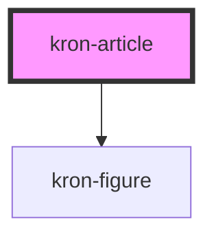

# kron-article

<!-- Auto Generated Below -->

## Properties

| Property             | Attribute            | Description | Type      | Default     |
| -------------------- | -------------------- | ----------- | --------- | ----------- |
| `content`            | `content`            |             | `string`  | `undefined` |
| `isValidContentLogo` | `addlogo`            |             | `boolean` | `undefined` |
| `mainSectionWrite`   | `main-section-write` |             | `string`  | `undefined` |
| `titles`             | `titles`             |             | `string`  | `undefined` |

## Dependencies

### Depends on

- [kron-figure](../kron-figure)

### Graph

----------------------------------------------

*Built with [StencilJS](https://stenciljs.com/)*
