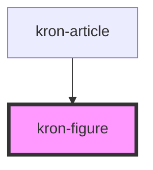

# kron-figure

<!-- Auto Generated Below -->

## Properties

| Property     | Attribute    | Description | Type      | Default     |
| ------------ | ------------ | ----------- | --------- | ----------- |
| `figcaption` | `figcaption` |             | `string`  | `undefined` |
| `image`      | `image`      |             | `any`     | `undefined` |
| `isValid`    | `isvalid`    |             | `boolean` | `true`      |

## Dependencies

### Used by

 - [kron-article](../kron-article)

### Graph

----------------------------------------------

*Built with [StencilJS](https://stenciljs.com/)*
